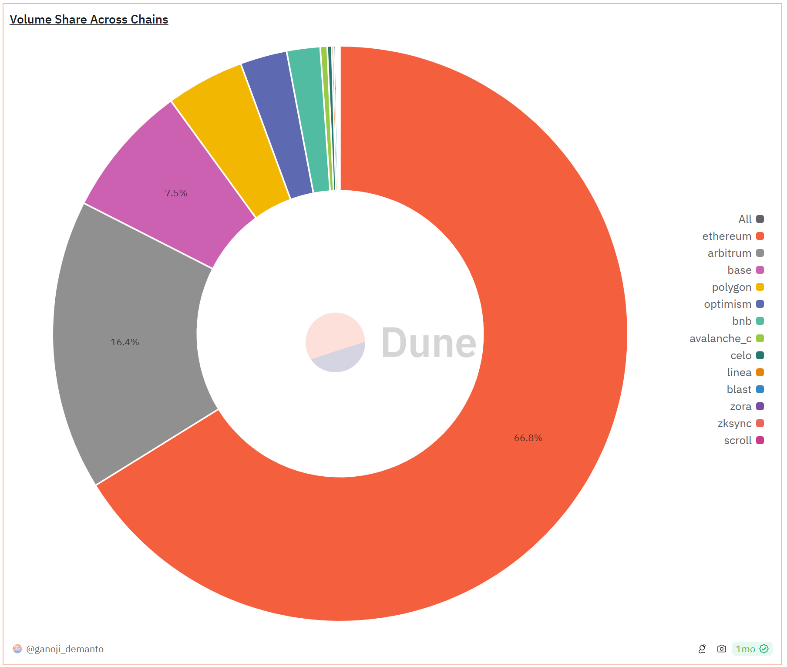
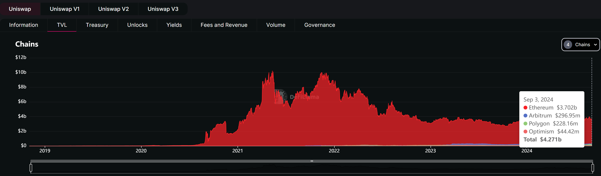
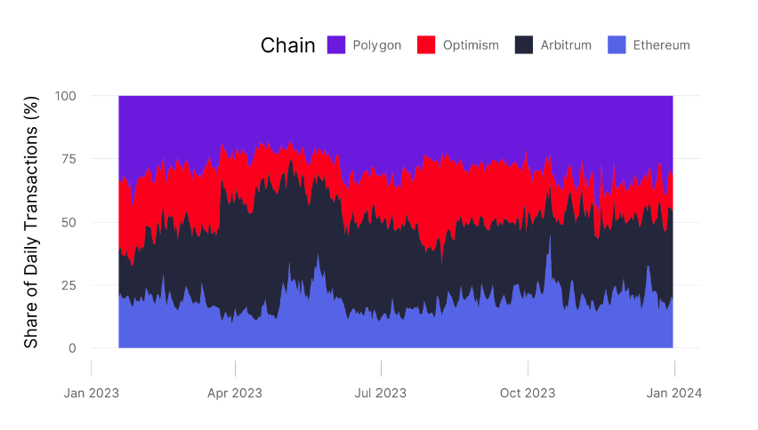
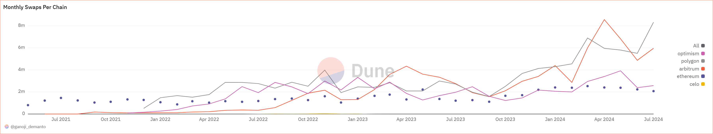

# Analysis

In this section, we discuss in detail the impact of Uniswap's scalability issue on user experience, transaction costs, and platform growth. Following, a comparison of two layer2 and side-chain solutions, we examine their benefits for stated impacts. Finally, we discuss the trade-offs between scalability, security, and decentralization of each solution.

## 4.1 Impacts

### _insert Alice's impact analysis here_

## 4.2 Comparison of solutions

Besides the Ethereum mainnet, Uniswap v3 deploys mainly on two Ethereum rollups (Arbitrum and Optimism) and one Ethereum sidechain (Polygon). These chains share Uniswap's majority volume and TVL. (Shown in Figures 1 and 2). However, it is worth noticing that although volume and TVL are still dominant by the Ethereum mainnet, the L2s occur in more transaction counts and swaps. (Shown in Figures 3 and 4). One of the explanations for this observation is that the expensive gas cost at mainnet forces users to trade with large order sizes and the cheap gas fee attracts more retail traders to execute swaps at L2s. Table 1 indicates the larger median trade size number, which verifies the stated argument.

**Figure 1. Volume Share Across Chains [1]**

**Figure 2. TVL Across Chains [2]**

**Figure 3. Share of Daily Transactions [3]**

**Figure 4. Monthly swaps [1]**

Referencing Table 1, it is evident that the gas cost of swaps is significantly lower on Layer 2 solutions and sidechains. Specifically, the gas cost is reduced by approximately 35 times on Arbitrum, 40 times on Optimism, and 333 times on Polygon.

TPS defines a blockchain's "speed". It is one of the direct measurements of scalability. In general, it is always preferable for any dapp (especially DEX) to operate on a faster chain. Traders will make their order be processed and filled as soon as possible. On the Ethereum mainnet, users sometimes need to increase the gas fee (priority fee) to ensure their transactions are processed first.
It is evident that when a network is busy, the gas fees will always increase.

Table 2, indicates L2s are all "faster" in terms of TPS compared to Ethereum by each of their unique solution for improving the scalability. Arbitrum has an amazing 40,000 theoretical TPS, which is competitive even in many web2 service providers. The trade-offs Layer 2 solutions make to achieve such remarkable TPS will be discussed in the following section.

**Table 1. Uniswap V3 Protocol Statics[4]**
| Chain | Number of Distinct Protocol Swaps | Number of Distinct Interface Swaps | Median Protocol Trade Size ($) | Median Interface Trade Size ($) | Total Volume ($m) | Median Gas Cost Of Swap |
| -------- | --------------------------------- | ---------------------------------- | ------------------------------ | ------------------------------- | ----------------- | ----------------------- |
| Arbitrum | 27,615,184 | 7,771,485 | 414.63 | 144.89 | 80,497 | 0.28 |
| Polygon | 24,493,627 | 6,405,620 | 85.13 | 51.36 | 24,597 | 0.03 |
| Ethereum | 15,614,849 | 7,532,822 | 1,192.06 | 692.89 | 277,423 | 10.00 |
| Optimism | 10,840,567 | 2,019,364 | 40.29 | 47.74 | 12,529 | 0.25 |

**Table 2. Chain Stats: Transaction per second[5]**
| Chain | Max Theoretical TPS | Real-Time TPS | Max Recorded TPS |
| -------- | ------------------- | ------------- | ---------------- |
| Arbitrum | 40,000 | 16.54 | 669 |
| Ethereum | 119 | 12.9 | 62.34 |
| Polygon | 649 | 34.76 | 429 |
| Optimism | 714 | 8.13 | 67.41 |

\*Real-time TPS shows how many transactions per second the blockchain is processing.\_

\*Max Recorded TPS represents the highest number of transactions per second achieved by a blockchain in its history.\_

\*Max Theoretical TPS shows how many transactions per second the blockchain is theoretically capable of handling.\_

## References

[1] G. Demanto, "Uniswap MultiChain: In-Depth Analysis," Dune Analytics, [Online]. Available: <https://dune.com/queries/2002302/3312987>. [Accessed: Sep. 04, 2024].

[2] Defillama, "Uniswap TVL," [Online]. Available: <https://defillama.com/protocol/uniswap#tvl-charts>. [Accessed: Sep. 04, 2024].

[3] A. Adams, "Uniswap Protocol Share of Transactions on L2s," Dune Analytics, [Online]. Available: <https://dune.com/queries/3435845/5771579>. [Accessed: Sep. 04, 2024].

[4] A. Adams, "Layer 2 be or Layer not 2 be: Scaling on Uniswap v3," pp. 5, Table 1.

[5] Chainspect, "Chain Stats", [Online]. Available: <https://chainspect.app/chain/optimism>. [Accessed: Sep. 04, 2024].
