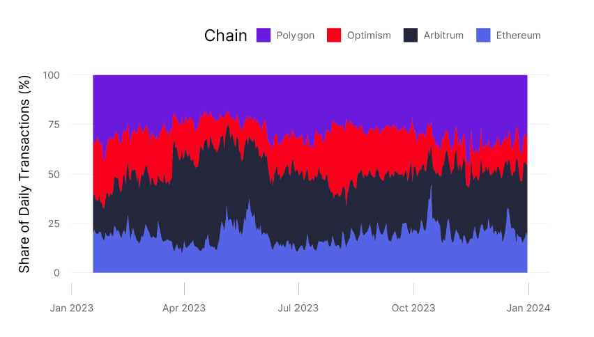
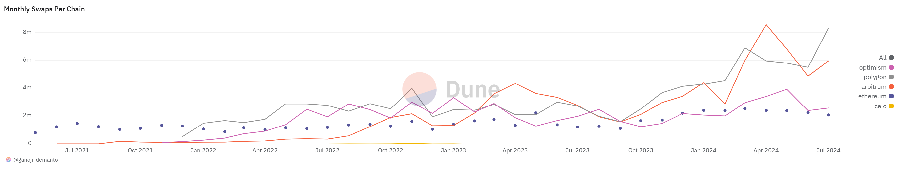

# Analysis of Uniswap's Scalability

In this section, we discuss in detail the impact of Uniswap's scalability issue on transaction fees, user experience and platform growth. Following, a comparison of two layer2 and side-chain solutions, we examine their benefits for stated impacts. Finally, we discuss the trade-offs between scalability, security, and decentralization of each solution.

## 4.1 Impacts

Uniswap operates on the Ethereum network, which has faced significant issues from time to time, especially during periods of high network activities. This could lead to the potential issues listed below.

### 4.1.1 Impact on transaction fees

Uniswap users often have to pay unprofitable transaction costs during peak times, which could make their relatively smaller sized trades not so feasible to be made on Uniswap[1].
It is also typically understood that decentralized exchanges (DEXs) such as Uniswap generally offer lower trasnaction fees compared to centralized exchanges (CEXs)[2][3]. However, that does not negate the high transaction fees that users often have to pay during peak times when there is network congestion.

Furthermore, the transparency of Ethereum transactions, specifically the ones that are pending, makes Uniswap even more vulnerable to inevitable front-running attacks. Front-running attacks are scenarios where bots are utilized to automate the process of placing large trades with higher gas fees in front of others' to maximize the profit gain out of it. Such market manipulation forces normal, non-frontrunning participating users to pay increased transaction fees to get their transactions processed[4].

### 4.1.2 Impact on User Experience (UX)

On top of unfavourable transaction fees, slow transaction processing time is another key factor that could drive adoption away. Due to the nature of on-chain trades being executed by smart contracts being slow, causing normal traders to miss out on trade opportunities[5]. As such, poor user experience arising from high gas fees and slow transaction times could deter new user onboarding and lose the existing ones to other faster and convenient networks[1]. Especially for the new users, who would already be facing initial challenges of the high learning curve of blockchain applications, will have high likelihood of giving up entirely and revert back to what they're comfortable with.

### 4.1.3 Impact on Platform Growth

Scalability issues can also slow down innovation of the platform. Projects that wish to integrate uniswap's feautres might find it challenging to conduct thorough testing that requires frequent on-chain interactions due to high gas fees and network congestion. This can slow down Uniswap's ability to evolve and maintain its competitive edge in the rapidly changing DeFi landscape.

Coupled with poor UX and high transaction fees due to non-ethical, profit-driven practices, these already existent issues could further deteriorate the protocol's reputation, thus losing its customers to other more user-friendly platforms such as centralized exchanges or to traditional banks that a large majority has been using for many decades, which then defeats the main reason why decentralized exchanges like Uniswap was created.

## 4.2 Comparison of solutions

Besides the Ethereum mainnet, Uniswap v3 deploys mainly on two Ethereum rollups (Arbitrum and Optimism) and one Ethereum sidechain (Polygon). These chains share Uniswap's majority volume and TVL. (Shown in Figures 1 and 2). However, it is worth noticing that although volume and TVL are still dominant by the Ethereum mainnet, the L2s occur in more transaction counts and swaps. (Shown in Figures 3 and 4). One of the explanations for this observation is that the expensive gas cost at mainnet forces users to trade with large order sizes and the cheap gas fee attracts more retail traders to execute swaps at L2s. Table 1 indicates the larger median trade size number, which verifies the stated argument.

**Figure 1. Volume Share Across Chains [6]**

**Figure 2. TVL Across Chains [7]**

**Figure 3. Share of Daily Transactions [8]**

**Figure 4. Monthly swaps [6]**

Referencing Table 1, it is evident that the gas cost of swaps is significantly lower on Layer 2 solutions and sidechains. Specifically, the gas cost is reduced by approximately 35 times on Arbitrum, 40 times on Optimism, and 333 times on Polygon.

TPS defines a blockchain's "speed". It is one of the direct measurements of scalability. In general, it is always preferable for any dapp (especially DEX) to operate on a faster chain. Traders will make their order be processed and filled as soon as possible. On the Ethereum mainnet, users sometimes need to increase the gas fee (priority fee) to ensure their transactions are processed first.
It is evident that when a network is busy, the gas fees will always increase.

Table 2, indicates L2s are all "faster" in terms of TPS compared to Ethereum by each of their unique solution for improving the scalability. Arbitrum has an amazing 40,000 theoretical TPS, which is competitive even in many web2 service providers.

**Table 1. Uniswap V3 Protocol Statics[9]**

| Chain    | Number of Distinct Protocol Swaps | Number of Distinct Interface Swaps | Median Protocol Trade Size ($) | Median Interface Trade Size ($) | Total Volume ($m) | Median Gas Cost Of Swap |
| -------- | --------------------------------- | ---------------------------------- | ------------------------------ | ------------------------------- | ----------------- | ----------------------- |
| Arbitrum | 27,615,184                        | 7,771,485                          | 414.63                         | 144.89                          | 80,497            | 0.28                    |
| Polygon  | 24,493,627                        | 6,405,620                          | 85.13                          | 51.36                           | 24,597            | 0.03                    |
| Ethereum | 15,614,849                        | 7,532,822                          | 1,192.06                       | 692.89                          | 277,423           | 10.00                   |
| Optimism | 10,840,567                        | 2,019,364                          | 40.29                          | 47.74                           | 12,529            | 0.25                    |

**Table 2. Chain Stats: Transaction per second[10]**

| Chain    | Max Theoretical TPS | Real-Time TPS | Max Recorded TPS |
| -------- | ------------------- | ------------- | ---------------- |
| Arbitrum | 40,000              | 16.54         | 669              |
| Ethereum | 119                 | 12.9          | 62.34            |
| Polygon  | 649                 | 34.76         | 429              |
| Optimism | 714                 | 8.13          | 67.41            |

\*Real-time TPS shows how many transactions per second the blockchain is processing.\_

\*Max Recorded TPS represents the highest number of transactions per second achieved by a blockchain in its history.\_

\*Max Theoretical TPS shows how many transactions per second the blockchain is theoretically capable of handling.\_

## 4.3 Trade-offs of solutions

In the previous section, we have talked enough about the Ethereum L2s and sidechain solution's remarkable performance on gas cost efficiency and TPS, this section will discuss more about their drawbacks.

First of all, L2s have such a characteristic that a group of privileged actors makes the sequencing of transactions, in other words, all rollups utilize centralized sequencers. Sequencers can, and be beneficial to, re-order transactions easily to generate MEV profits because of their prioritized role in the system. This encourages the notorious sandwich attack, traders on DEXs nowadays greatly suffer from the front-run transactions and get unwanted lost. MEV impacts decentralization and stability in block production badly as well.

Second, each solution has its ecosystem which creates fragmented liquidity. There is no native way for them to trustless sharing information in realtime at the moment. That is saying, that liquidity at all different L2s is not composable. To provide liquidity at different L2s, LPs (liquidity providers) have to lock up capital repetitively on each L2 to facilitate trading. This causes arbitrage which introduces extra cost for LPs and the user suffers from a higher price impact due to the liquidity being fragmented.

Third, security is facing challenges in L2s. In optimistic rollups, there is no trivial way to recover from sequencer errors or incorrect transactions, in other words, lack of fraud proof. Optimistic rollups treat all transactions as valid by default, it requires a sophisticated actor to proof of the invalidity of a posted transaction/block within seven days. That is saying, any invalid transaction will be processed and canonical.

At the current stage, L2s such as Optimism and Arbitrum are implementing their dedicated fraud proofs. On Optimism, fraud proofs allow the trustless and retroactive dispute of a transaction from the canonical state roots, effectively removing it from the chain trustlessly if the fraud-proof is valid. On Arbitrum, if there are conflicting state root proposals, validators stake on histories - effectively utilizing the fraud proofs to solve the fork choice. [9] More work still needs to be done for productionalizing fraud proofs.

Lastly, it is costly to bridge between different ecosystems. Users are required to return the assets to the mainnet before they enter another ecosystem. On optimistic rollups, bridging assets to mainnet require approximately seven days, and depositing assets onto an L2 ecosystem cost around an average of 8 dollars worth of gas price. This brings inconvenience for users who are time or cost-sensitive.

## References

[1] A. Adams, B. Chan, S. Markovich, and X. Wan, “Don’t Let MEV Slip: The Costs of Swapping on the Uniswap Protocol \*,” 2024. Accessed: Sep. 15, 2024. [Online]. Available: <https://arxiv.org/pdf/2309.13648>. [Accessed: Sep. 14, 2024].

[2] AlphaPoint, "DEX vs CEX: What's the Difference?", [Online]. Available: <https://alphapoint.com/blog/dex-vs-cex/.> [Accessed: Sep. 15, 2024].

[3]B. George, “Centralized Exchange (CEX) vs. Decentralized Exchange (DEX): What’s the Difference?,” CoinDesk, [Online]. <https://www.coindesk.com/learn/centralized-exchange-cex-vs-decentralized-exchange-dex-whats-the-difference/>. [Accessed: Sep. 14, 2024].
‌
[4] Torres, C. F., Schütte, J., & State, R. (2021). Frontrunner Jones and the Raiders of the Dark Forest: An Empirical Study of Frontrunning on the Ethereum Blockchain. In 30th USENIX Security Symposium (USENIX Security 21) (pp. 1343-1359).

[5] Daian, P., et al. "Flash boys 2.0: Frontrunning, transaction reordering, and consensus instability in decentralized exchanges" 2020 IEEE Symposium on Security and Privacy (SP), IEEE, 2020.

[6] G. Demanto, "Uniswap MultiChain: In-Depth Analysis," Dune Analytics, [Online]. Available: <https://dune.com/queries/2002302/3312987>. [Accessed: Sep. 04, 2024].

[7] Defillama, "Uniswap TVL," [Online]. Available: <https://defillama.com/protocol/uniswap#tvl-charts>. [Accessed: Sep. 04, 2024].

[8] A. Adams, "Uniswap Protocol Share of Transactions on L2s," Dune Analytics, [Online]. Available: <https://dune.com/queries/3435845/5771579>. [Accessed: Sep. 04, 2024].

[9] A. Adams, "Layer 2 be or Layer not 2 be: Scaling on Uniswap v3," pp. 5, Table 1.

[10] Chainspect, "Chain Stats", [Online]. Available: <https://chainspect.app/chain/optimism>. [Accessed: Sep. 04, 2024].
